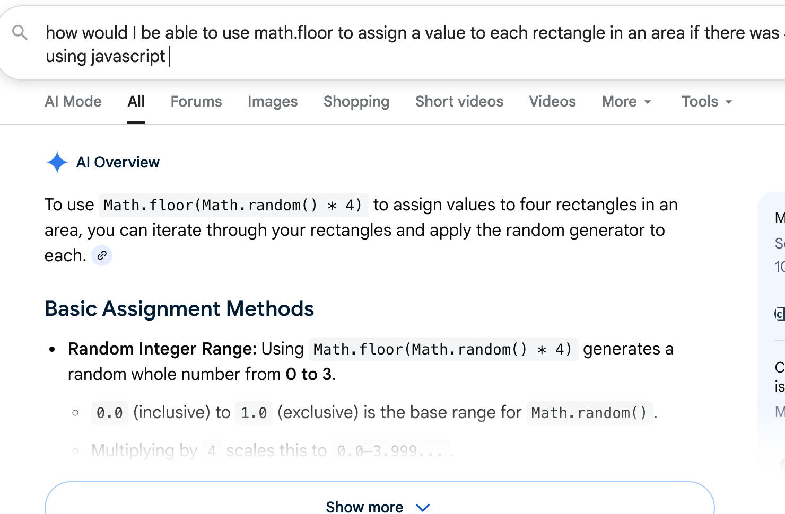
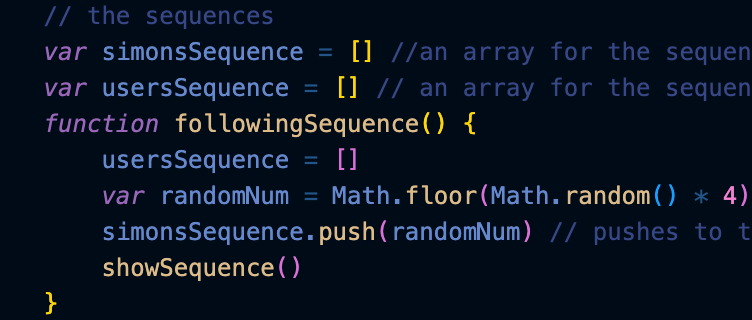

# Entry 5
##### 4/19/26

### Content
Since the previous entry I really have been focused on putting everything together to make a functioning program where my game will run. Along the way I did have to learn a lot of things I didn't previously know before to conjoin all my code together because I often ran into a lot of bugs where my preview would just crash or everything will run chaotically. Obviously I have been using what I've learned into the code and building it quickly since the MVP was due in a short amount of time, however, I often ran into trouble connecting it with JavaScript which I also added a heavy amount of in my freedom project. So I haven't really been learning any new code, but I couldn't find anywhere exactly how to make it function with each other because I had a clear picture in my head of how I wanted my project to act and look like on the page. Therefore I had been using Google, Reddit, and some AI as contributers to my learning. Mr. Mueller said to use this as a last resort, and I have for I needed to learn and deep dive back into previous periods of Javascript. I didn't have many difficulties with the conditionals or certain Javascript elements, my weakness stemmed with arrays and functions. There were so many variables I had created that I couldn't even keep track with anymore and it all became so confusing. So actually how I've been learning how to piece everything together and creating certain portions of my MVP was to the help of what I previously mentioned. I didn't want to cheat and tell Google or AI to just make my whole project and add Kaboom in it since I've worked so hard with trying to learn Kaboom in the first place, so I asked it things that wouldn't affect my learning negatively, in ways of understanding and completing the entirety of my project. I finished my freedom project MVP on schedule; from there I will present it to the class in the following week.

<a href="https://github.com/annad2694/sep11-freedom-project/blob/main/index2.html">Link to my Freedom Project.</a>

### EDP 
I am definitely on step 6 of the engineering design process, where I am testing and evaluating the prototype to make sure it is efficent and works smoothly. I needed a working version and that is what I am trying to success to complete my MVP. The next step of the journey is to move onto step 7 after I present: to improve as needed. I plan to shorten my code and make more cool features to present to others that make my game animation more enjoyable. 

### Skills
Two skill I have been utilizing from the hstatsep students website would definitely be attention to detail for I have to pay very close attention because one thing missing or accidently erased screws with my whole program and it's so annoying because it happens to often. I'd also like to say debugging has been a skill I have utilized recently like never before, I've had to change my code repeatedly to get it to work in synchronization with the rest of the code that is running all at once at 60 frames per second. 

[Previous](entry04.md) | [Next](entry06.md)

[Home](../README.md)
